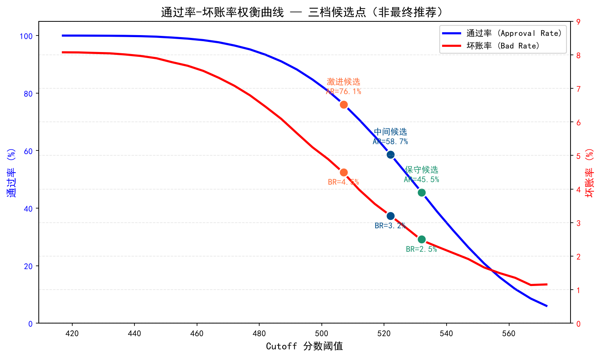
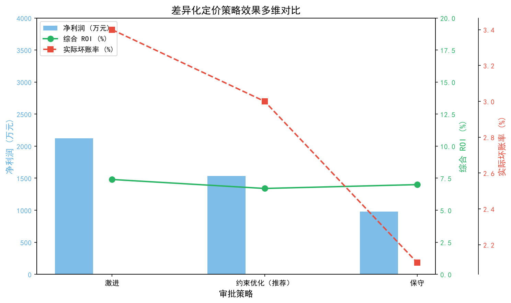

# 家庭信贷违约风险模型

## 基于Kaggle家庭信贷竞赛数据集构建的**违约概率（PD）模型**，完整遵循零售银行建模规范——从多表原始数据到可解释评分卡与信贷策略分析。
> **项目亮点**：基于评分卡模型输出，设计完整风控策略体系（三段式审批、差异化定价、策略监控）。在“批准客户坏账率不超过 3%、整体通过率不低于 35%”的业务约束下，以固定利率场景净利润最大化自动选择 **Cutoff=520**；沿用同一批准人群进行差异化定价后，模拟坏账率为 **3.0%**、综合 ROI 为 **6.7%**。

[](https://python.org)
[](https://scikit-learn.org)
[](https://lightgbm.readthedocs.io)

---

## 目录

- 模型效果

- 项目目录结构

- 机器学习流水线

- 快速启动指南

- 实验笔记本

- 建模方法论

- 数据集说明

- 个人增量贡献
  - 实验1：特征筛选 IV 阈值对比
  - 实验2：PDO 分值缩放对比
  - 实验3：Optbin / 等频分箱对照实验
  - 实验4：风控策略与 Cutoff 分析
    - 4.1 核心指标随 Cutoff 变化趋势
    - 4.2 三档策略对比分析
    - 4.3 三段式决策区间分析
    - 4.4 固定利率业务收益测算
    - 4.5 差异化定价策略实验
    - 4.6 全档位通过率 - 坏账曲线挖掘
    - 4.7 线上模型 & 策略监控体系
    - 4.8 结论与建议

---

## 模型效果

| 模型                   |训练集AUC|随机分层留出集AUC|随机分层留出集KS|随机分层留出集基尼系数|分布稳定性PSI|
|-----------------------|---------|--------------|-------------|------------------|---------------|
|虚拟基准分类器           |0.500    |0.502        |0.000         |0.003             |—--------------|
|逻辑回归（证据权重评分卡）|0.763    |0.762        |0.3989        |0.524             |0.0002         |
|梯度提升树LightGBM      |0.828     |0.772       |0.4149        |0.5446             |--------------—|

**最终选用逻辑回归搭建评分卡**：预测性能具备竞争力、完全可解释，并有利于模型审查与治理。LightGBM 仅作为性能对比基准。

**最终结果口径**：上表来自 `notebooks/08_validation.ipynb`，使用 246,008 条训练样本和 61,503 条分层随机留出样本（80/20，`random_state=42`），最终特征版本为 56 个特征。逻辑回归评分卡工件由 `05_baseline_models.ipynb` 生成，LightGBM 基准工件由 `06_lgbm_model.ipynb` 生成。策略 ROI 是 `09_strategy_cutoff_analysis.ipynb` 的业务仿真结果：约束优化策略在固定利率场景下 ROI 为 4.5%，在相同批准人群的差异化定价场景下 ROI 为 6.7%，两者不能混作模型区分指标。

### 行业指标对标

|指标          |行业最低合格标准|本模型结果|达标状态    |
|--------------|--------------|---------|-----------|
|AUC           |0.65          |0.762    |✅ 表现良好|
|KS区分度       |0.20          |0.3989   |✅ 表现良好|
|基尼系数Gini   |0.30          |0.524    |✅ 表现良好|
|人群稳定性PSI  |< 0.10        |0.0002   |✅ 本次随机切分下差异较小|

### 策略效果摘要（基于评分卡输出 + 差异化定价）：

| 策略              | Cutoff | 通过率     | 坏账率    | 综合ROI  |
|------------------|---------|-----------|----------|----------|
| 激进             | 512     | 46.9%     | 3.4%     | 7.4%     |
| **约束优化（推荐）** | **520** | **37.3%** | **3.0%** | **6.7%** |
| 保守             | 537     | 22.8%     | 2.1%     | 7.0%     |

---

## 项目目录结构

```Plaintext
home-credit-default-risk/
│
├── README.md
├── requirements.txt
├── environment.yml
├── .gitignore
│
├── data/
│   ├── raw/                        # Kaggle原始CSV文件（版本库不追踪）
│   └── processed/                  # 中间处理Parquet文件（版本库不追踪）
│       ├── master_table.parquet    # 合并后主表
│       ├── train_woe.parquet        # 训练集证据权重转换数据
│       ├── oot_woe.parquet          # 随机分层留出集证据权重数据（历史文件名保留）
│       ├── train_scores.parquet     # 训练集打分结果
│       └── oot_scores.parquet       # 随机分层留出集打分结果（历史文件名保留）
│
├── notebooks/
│   ├── 01_data_overview.ipynb      # 数据表结构、关联键、数据量概览
│   ├── 02_eda_main.ipynb           # 探索性数据分析、统计检验、可视化图表
│   ├── 03_feature_engineering.ipynb # 7张表关联、聚合衍生特征
│   ├── 04_woe_iv_selection.ipynb   # 信息价值IV筛选、证据权重编码、相关性剔除
|   ├── 04.1_experiment_binning_comparison.ipynb # 【实验3】最优分箱 vs 等额分箱对比 
│   ├── 05_baseline_models.ipynb    # 基准虚拟模型 → 逻辑回归建模
│   ├── 06_lgbm_model.ipynb         # LightGBM建模、SHAP特征解释、交叉验证调参
│   ├── 07_scorecard.ipynb          # PDO分值缩放、生成完整评分卡表格
│   ├── 08_validation.ipynb         # KS、基尼、PSI、校准曲线、随机留出验证
|   ├── 09_strategy_cutoff_analysis.ipynb #【实验4】风控策略分析：Cutoff选择与ROI测算 (策略应用阶段)
│   └── 10_final_summary.ipynb      # 看板汇总、多模型对比、项目结论
│
├── models/                         # 序列化模型文件（版本库不追踪）
│   ├── README.md                   # 产物来源与版本兼容说明
│   ├── artifacts_manifest.json     # 特征、切分和依赖版本清单
│   ├── logreg_woe.pkl
│   ├── lgbm_model.pkl
│   ├── binning_process.pkl
│   ├── feature_names.json
│   └── scorecard_table.csv         # ← 纳入版本库：核心交付物评分卡
│
```

---

## 机器学习流水线

```Plaintext
原始多表数据（共7张数据表）
        │
        ▼
  探索性数据分析+数据清洗              实验笔记本02
  ├── 缺失值分布分析
  ├── 曼-惠特尼U检验（数值型特征区分力检验）
  └── 卡方检验（分类型特征区分力检验）
        │
        ▼
  特征工程衍生处理         实验笔记本03
  ├── 征信记录表+征信月度状态表 → 历史逾期聚合特征
  ├── 历史申请记录表    → 过往审批通过率、信贷使用率
  ├── 分期还款记录表   → 逾期还款比例、欠款未结清金额
  ├── 信用卡月度账单表     → 额度使用率、逾期月份记录
  └── POS分期现金贷月度表        → 合同履约情况、逾期月数
        │
        ▼
  特征分箱对比 (最优 vs 等额) -- 实验笔记本04.1
        │
        ▼
  特征筛选剔除           实验笔记本04
  ├── 信息价值IV ≥ 0.02  筛选规则
  ├── 基于最优分箱的证据权重编码
  └── 相关性阈值0.85剔除多重共线性 → 最终保留56个入模特征
        │
        ├──────────────────────────────┐
        ▼                              ▼
  逻辑回归模型          LightGBM梯度提升树              实验笔记本05–06
  (可解释、可生成评分卡)   (性能对比基准模型)
        │                              │
        ▼                              ▼
  信用评分卡（PDO=20）           SHAP特征贡献值            实验笔记本07
  基于分值的信贷打分体系
        │
        ▼
  随机分层留出样本验证         实验笔记本08
  ├── KS区分度、AUC、基尼系数
  ├── PSI人群稳定性（打分分布稳定性）
  └── 模型校准曲线检验
        │
        ▼
   风控策略分析 (Cutoff选择 & ROI测算) -- 实验笔记本09
        │
        ▼  
   项目总结与看板 -- 实验笔记本10 
       


  
```

### 核心衍生特征清单

|特征名称                 |数据来源      |信息价值IV| 特征说明             |
|------------------------|-------------|----------|---------------------|
|`EXT_SOURCE_3`          |主申请表      |0.335    |第三方征信机构外部评分  |
|`EXT_SOURCE_2`          |主申请表      |0.319    |第三方征信机构外部评分  |
|`bureau_bb_max_dpd`     |征信月度状态表 | —       |征信记录史上最长逾期天数|
|`inst_late_payment_rate`|分期还款表    | —       |历史分期逾期还款占比    |
|`DAYS_EMPLOYED`         |主申请表      |0.116    |在职时长（距当前天数）  |
|`prev_approval_rate`    |历史申请表    | —       |过往信贷申请审批通过比例|

---

## 快速启动指南

### 环境前置要求

- Python 3\.11.x（已在 3.11.4 测试）

- Kaggle账号（用于下载竞赛数据集）

### 1 · 克隆项目并安装依赖

```Bash
git clone https://github.com/Mekhty111/Home-Credit-Default-Risk.git
cd Home-Credit-Default-Risk
python -m venv venv
source venv/bin/activate        # Windows系统执行：venv\Scripts\activate
pip install -r requirements.txt
```

也可以使用 `conda env create -f environment.yml` 创建锁定的 Conda 环境。

### 2 · 下载数据集

```Bash
# 通过Kaggle命令行工具下载
kaggle competitions download -c home-credit-default-risk -p data/raw/
cd data/raw && unzip home-credit-default-risk.zip && cd ../..
```

也可手动访问 [kaggle\.com/c/home\-credit\-default\-risk/data](https://www.kaggle.com/c/home-credit-default-risk/data) 将压缩包解压至 `data/raw/` 目录。

### 3 · 按顺序运行实验笔记本

```Bash
jupyter notebook
```

按编号顺序执行 `notebooks/01_data_overview.ipynb` 至 `notebooks/10_final_summary.ipynb`，每个笔记本产出的文件会被后续实验调用。`04.1_experiment_binning_comparison.ipynb` 是可选的分箱对照实验，`09_strategy_cutoff_analysis.ipynb` 是策略分析阶段。

## 风险分层规则

|信用分数  |风险等级|业务审批建议     |
|---------|-------|----------------|
|< 520    |极高风险|直接拒绝         |
|520 – 560|高风险  |人工复核         |
|560 – 600|中等风险|附条件审批       |
|600 – 640|低风险  |直接放款         |
|> 640    |极低风险|放款\+最优优惠利率|

>基于业务经验预设的 5 档风险分层规则（Cutoff）；输出训练集分数分布分位数，验证了策略阈值合理性。
## 实验笔记本说明

| 编号 | 笔记本名称                    | 核心产出                                                                     |
| ---- | ---------------------------- | --------------------------------------------------------------------------- |
| 01   | 数据概览                      | 数据表结构、多表关联关系图，原始数据集样本统计                                   |
| 02   | 探索性数据分析EDA              | 特征统计检验、缺失值分布分析、好坏样本分布可视化图表                             |
| 03   | 特征工程                      |合并后主表master\_table\.parquet（30.7万条样本），衍生特征宽表                   |
| 04   | 证据权重与信息价值筛选          |训练集WoE转换表train\_woe\.parquet、分箱规则文件binning_process.pkl、IV特征排序表|
| 4.1  | 特征分箱对比(最优/等频)         | 最优分箱&等频分箱IV对比表格、模型指标对比、分箱效果对比可视化                     |
| 05   | 基准模型                       | 逻辑回归模型logreg\_woe\.pkl、训练/留出集AUC/KS/Gini基准指标                    |
| 06   | LightGBM建模+SHAP解释          | LightGBM模型lgbm\_model\.pkl、SHAP全局重要性、蜂群图、单样本瀑布解释图          |
| 07   | 评分卡生成                     | 完整评分卡scorecard\_table\.csv，客户打分函数，样本分数输出文件                 |
| 08   | 模型验证                       | KS/基尼/PSI/校准曲线可视化图表，训练集&留出集全套评估指标                          |
| 09   | 风控策略分析(Cutoff选择/ROI测算)| 三档、多档cutoff策略效果表、权衡曲线图，差异化定价仿真ROI结果、差异化效果多维对比图|
| 10   | 项目最终汇总                   | 综合评估看板、多模型横向对比、项目整体结论                                      |


## 建模方法论

### 证据权重WoE / 信息价值IV

所有连续特征通过**最优分箱算法**划分区间，并转换为证据权重分值，WoE代表分箱内好客户/坏客户对数比率；信息价值IV低于0.02的特征判定为无区分力，直接剔除。

```Plaintext
单分箱证据权重 WoE_i = ln(分箱内好客户占比 / 分箱内坏客户占比)
总信息价值 IV    = Σ (分箱好客户占比 − 分箱坏客户占比) × 对应分箱WoE
```

|IV区间        |特征区分能力判定     |
|--------------|-------------------|
|< 0.02        |无预测能力 — 直接剔除|
|0.02 – 0.10   |区分力较弱          |
|0.10 – 0.30   |区分力中等          | 
|> 0.30        |区分力极强          |

### 评分卡分值缩放规则

逻辑回归模型通过标准PDO缩放公式转换为业务可读分值卡：

```Plaintext
信用分数  = 基础偏移量OFFSET + 缩放系数FACTOR × ln(好坏客户比值odds)
模型坏账logit = ln(坏/好) = 截距 + Σ(系数 × WOE)
因此信用分数 = OFFSET − FACTOR × 模型坏账logit
缩放系数FACTOR = PDO / ln(2)
基础偏移量OFFSET = 基准分数 − FACTOR × ln(基准好坏比值)
```

本项目参数设置：`PDO=20`，`基准分数=600`，`基准好坏比值=19`（对应5%违约率）：
即分数每提升20分，好/坏赔率翻倍（在低违约率区间可近似理解为违约概率减半）。

### 验证方案说明

项目采用**分层随机留出验证**（训练集80%、留出集20%，`random_state=42`）。留出集全程不参与特征筛选、分箱拟合和模型训练。由于 Home Credit 数据缺少可靠的申请时间字段，该验证集不能称为真正的时间外（OOT）或未来客群验证。
**分布稳定性 PSI**用于比较训练集与随机留出集的评分分布：

```Plaintext
PSI = Σ (验证集分箱占比 − 训练集分箱占比) × ln(验证集分箱占比 / 训练集分箱占比)
本项目PSI = 0.0002  → 该随机切分下未观察到明显分布偏移
```

### 特征时点可用性（Point-in-time）

bureau、previous_application、installments、credit_card 和 POS/CASH 等历史表的聚合特征，原则上只能使用申请决策时点及之前已经产生的信息。生产环境中不得把申请之后生成的记录带入特征。由于公开 Home Credit 数据缺少可靠的申请时间字段，项目无法证明真正的时间外泛化能力，因此结果统一报告为分层随机留出验证。

---

## 数据集说明

**数据来源：** Kaggle竞赛 [家庭信贷违约风险](https://www.kaggle.com/c/home-credit-default-risk)

|数据表名称                  |数据行数   |表说明                   |
|---------------------------|----------|------------------------|
|`application_train.csv`    |307,511   |主申请表\+标签变量        |
|`bureau.csv`               |1,716,428 |第三方征信历史记录        |
|`bureau_balance.csv`       |27,299,925|征信月度状态流水          |
|`previous_application.csv` |1,670,214 |用户过往家庭信贷申请记录   |
|`installments_payments.csv`|13,605,401|分期还款流水记录          |
|`credit_card_balance.csv`  |3,840,312 |信用卡月度账单流水         |
|`POS_CASH_balance.csv`     |10,001,358|POS消费分期、现金贷月度流水|

## **标签变量TARGET：** `TARGET = 1` 代表客户发生贷款违约，样本违约率8%，属于高度不平衡数据集。

## 项目依赖清单 requirements\.txt

`requirements.txt` 只保留项目直接依赖，并以 Python 3.11.4 环境测试。`scikit-learn`、`optbinning`、LightGBM 及序列化相关版本均已锁定，因为生成的 pickle 模型工件对版本敏感；需要完整环境时可使用 `environment.yml`。

---

*项目技术栈：Python · pandas · scikit\-learn · LightGBM · OptimalBinning最优分箱库*


## 个人增量贡献

### 实验 1：特征筛选深度分析 (IV 阈值对比)
| IV 阈值 | 特征数  | KS（训练集）  | KS（验证集）  | 前 5 特征是否变化  |  结论                   |
|---------|--------|--------------|--------------|-------------------|------------------------|
| 0.02    | 81     | 0.3941       | 0.3989       | 否                | 特征丰富，KS 稳定，保留  |
| 0.03    | 52     | 0.3874       | 0.3900       | 否                | KS 略降，特征精简，非最优 |
| 0.04    | 28     | —            | —            | —                 | 特征过少，跳过          |
| 0.05    | 17     | —            | —            | —                 | 特征过少，跳过          |

**结论**：将 IV 阈值从 0.02 提高到 0.03 后，入模特征从 81 个减少到 52 个，KS 指标微幅下降（0.3941 -> 0.3874）。
**特征稳定性**：排名前 5 的核心特征（EXT_SOURCE_3 / 2 / 1, bureau_days_credit_mean, DAYS_EMPLOYED）在阈值调整后保持稳定，证明模型核心逻辑稳健。
**决策**：考虑到业务上希望保留更多弱信号（如 OCCUPATION_TYPE 等位于 0.02-0.03 之间的特征）以提高模型对边缘客群的鲁棒性，最终选择 0.02 作为筛选标准。

### 实验 2：评分缩放与分层颗粒度评估 (PDO 对比)
| PDO 值 | 训练集标准差 | 验证集标准差 | 核心客群分数变化示例 |
|--------|-------------|------------|---------------------|
| 20     | 29.5897     | 29.3882    | 542                 |
| 15     | 22.1927     | 22.0398    | 556                 |

**原理解析**：PDO (Points to Double the Odds) 决定了分数的“斜率”。PDO=15 意味着分数每增加 15 分，好/坏客户的几率翻倍。
**分数分布变化**：PDO 从 20 降至 15，分数标准差从 29.6 大幅收窄至 22.2，分数层级的颗粒度变小。
**数值分析**：PDO 从 20 降至 15 后，同一客户绝对分数从 542 变为 556。这是由于 Base Score 计算公式随 PDO 参数同步变化，导致整体分数发生平移；PDO 的线性缩放不会改变客户风险排序，也不会改变 AUC、KS、Gini 等原始模型区分能力，但会改变分数间距和业务分层的可用颗粒度。
**决策建议**：在信用卡业务中，需要足够的分数间距来区分金卡/普卡客户及设定额度。PDO=15 会使风险分层更扁平，不利于差异化定价，因此维持 PDO=20 以保留足够的风控杠杆。


### 实验3：分箱策略对比实验：OptimalBinning 最优分箱 VS 等频 10 分箱

本次对照实验控制变量，选取 8 项连续特征，仅改变特征分箱方式，从单特征信息价值 IV 与逻辑回归模型预测效果两个维度开展对比。两组模型最终都只使用同一组 `cont_feats_exp` 连续特征。

**先梳理全部实验结果汇总**

**1）IV 层面**（8 个连续特征）
最优分箱总 IV = 1.2893
等频 10 箱总 IV = 1.2464
Optbin 整体信息价值更高；仅EXT_SOURCE_1等频分箱 IV 微小反超。

**2）LR 模型效果**（两组均使用同一套 `cont_feats_exp` 的 8 个连续特征）
表格
指标	   OptimalBinning 最优分箱	等频 10 箱 qcut
Train AUC	0.7389                    0.7367
Train KS	0.3572	                  0.3561
随机留出 AUC  	0.7379	                  0.7382
随机留出 KS  	0.3525	                  0.3586

**核心现象解读**
训练集表现：Optbin 更好
训练集 AUC、KS 均高于等频分箱，符合理论：有监督最优分箱挖掘特征区分能力，捕获更多风险信息。
随机留出测试集出现交叉
随机留出 AUC：两者几乎持平（0.7379 vs 0.7382，差距极小）
随机留出 KS：等频 10 箱反而小幅高于 optbin

**怎么解释这个看似矛盾的结果？**
1.两种分箱方案整体性能差距非常微弱，不存在断崖式拉开；
2.Optbinning 是有监督分箱，在训练集充分拟合好坏标签，更容易贴合训练样本分布；
3.无监督等频分箱不依赖标签分割区间，分箱规则更简单、泛化性偶尔会体现优势；
4.样本层面：特征整体区分力中等，两种分箱方式提取的有效信息差距不大；
5.关键：指标差值很小，属于正常随机波动范围，不能简单判定 “等频分箱更好”。


**实验分析与讨论**：

**分箱策略对比实验**：OptimalBinning 最优分箱 VS 等频 10 分箱

本次对照实验控制变量，选取 8 项连续特征，仅改变特征分箱方式，从单特征信息价值 IV与逻辑回归模型预测效果两个维度开展对比。
从单特征 IV 结果来看，OptimalBinning 有监督最优分箱累计 IV 达到 1.2893，高于等频 10 分箱的 1.2464。绝大多数特征经过最优分箱后信息价值更高；仅EXT_SOURCE_1出现等频分箱 IV 小幅反超现象，但差值微弱，属于样本分布带来的正常特例。原理上，OptimalBinning 利用标签信息寻找最优分割边界，最大限度保留特征区分好坏客户的风险信息；而等频分箱属于无监督分箱，仅依靠样本数量均匀划分区间，不参考逾期标签，容易割裂特征天然的风险单调性，造成信息损失。

在逻辑回归建模验证层面，训练集上 OptimalBinning 方案 AUC、KS 指标均优于等频分箱，和 IV 指标结论保持一致。随机留出验证集上两组模型效果高度接近：随机留出 AUC 几乎持平，随机留出 KS 等频分箱略有优势，但指标差距极小，属于正常随机波动范围，不能判定等频分箱整体性能更优。
该现象反映出两类分箱方案各自的优缺点：有监督最优分箱充分拟合训练集好坏样本分布，更容易挖掘特征风险信息，但分箱规则相对复杂；无监督等频分箱缺少标签引导，特征信息存在一定损耗，不过分箱边界简单，在部分场景下泛化性能衰减幅度更小。

**业务建模启示**
信贷评分卡建模场景下，优先推荐 OptimalBinning 最优分箱方案，能够充分挖掘特征风险区分能力。若项目面临样本量不足、训练集与线上真实客群分布差异较大、担心规则过拟合等问题，可将等频分箱作为备选方案，结合随机留出集稳定性综合权衡选择。

**实验局限性**
本次实验仅针对连续数值特征开展对比，分类特征未纳入实验范围，结论不能直接推广至分类变量；
候选特征集基于 OptimalBinning 的 IV 进行初选，存在一定选择偏倚；
数据集为 HomeCredit 公开竞赛数据，客群结构、业务场景和国内真实信贷业务存在差异，落地应用需要进一步验证；
两组模型在随机留出集上的指标差距较小，后续可结合多折交叉验证进一步巩固结论，或通过调整 Optbinning 的正则化参数（如 max_n_bins、min_prevalence）观察结论稳健性。

---

完成评分卡建模与验证后，下一步是将模型输出转化为可落地的风控策略。实验 4 将从 Cutoff 选择、三段式审批、差异化定价、策略监控等维度，完整呈现从“模型分数”到“业务决策”的转化过程。


### 实验4：风控策略与 Cutoff 分析

**【策略结论】**
策略不再手工指定 Cutoff。Notebook 会枚举整数阈值，在 **批准客户坏账率不超过 3%**、**整体通过率不低于 35%** 的约束下，以固定利率场景的预期净利润最大化为目标。修正评分卡截距符号并重新生成分数后，当前随机分层留出集自动选出 **Cutoff=520**：固定利率模拟坏账率为 **3.0%**、综合 ROI 为 **4.5%**；使用完全相同的批准人群进行差异化定价后，坏账率仍为 **3.0%**、综合 ROI 为 **6.7%**。

---

### 4.1 核心指标随 Cutoff 变化趋势

下表展示了低分区间的前十档不同 Cutoff 阈值下的通过率、坏账率及错误决策率的变化情况：

| Cutoff | 通过率 (Approval Rate) | 坏账率 (Bad Rate) | 误杀率 (False Positive) | 漏杀率 (False Negative) |
| ------ | --------------------- | ----------------- | ---------------------- | ----------------------- |
| 417    | 1.000000              | 0.080728          | 0.000000               | 1.000000                |
| 422    | 0.999967              | 0.080698          | 0.000000               | 0.999597                |
| 427    | 0.999756              | 0.080552          | 0.000053               | 0.997583                |
| 432    | 0.999463              | 0.080429          | 0.000212               | 0.995770                |
| 437    | 0.998878              | 0.080086          | 0.000424               | 0.990937                |
| 442    | 0.997951              | 0.079639          | 0.000867               | 0.984491                |
| 447    | 0.996212              | 0.078962          | 0.001875               | 0.974421                |
| 452    | 0.993155              | 0.077781          | 0.003661               | 0.956898                |
| 457    | 0.989431              | 0.076726          | 0.006261               | 0.940383                |
| 462    | 0.984228              | 0.075199          | 0.009852               | 0.916818                |

> **注**：上表仅展示前十档阈值，完整 Cutoff 扫描结果见 Notebook 原始输出。


**数据洞察：**

1.高风险区间 (Cutoff 417 - 427)：
通过率维持在 99.9% 以上，但坏账率也最高 (约 8.0%)。
此时误杀率极低，但漏杀率接近 100%，意味着几乎所有坏客户都被放行了，风险完全失控。

2.策略甜点区 (Cutoff 437 - 452)：
随着 Cutoff 升高，坏账率从 8.0% 迅速下降至 7.7%。
这是一个“高收益、低风险”的区间，也是我们重点关注的区域。

3.过度保守区间 (Cutoff > 452)：
通过率开始下降（低于 98.5%），坏账率下降趋缓（降至 7.5%）。
此时误杀率开始上升，意味着我们正在拒绝越来越多的好客户，边际效益递减。

**结论：**
本部分仅展示通过率、坏账率及错误决策率随阈值的变化。最终 Cutoff 由后续业务约束优化自动确定，详见 4.3-4.5 节。


### 4.2 三档策略对比分析

下表展示了阈值扫描阶段的三种典型候选点（激进、中间、保守）；这些直接通过率指标仅用于观察趋势，不代表最终约束优化结果：

| 策略定位              | Cutoff | 通过率 (AR) | 坏账率 (BR) | 误杀率 | 漏杀率 |
| -------------------- | ------ | ----------- | ---------- | ----- | ----- |
| **激进策略** (AR≈75%) | 507   | 76.1%       | 4.5%       | 20.9% | 42.2% |
| **均衡策略** (AR≈60%) | 522   | 58.7%       | 3.2%       | 38.2% | 23.3% |
| **保守策略** (AR≈45%) | 532   | 45.5%       | 2.5%       | 51.7% | 14.0% |

**综合分析与策略选择**：

1.  **激进策略 (Cutoff=507)**：
    *   **特点**：通过率最高 (76.1%)，但**漏杀率也最高 (42.2%)**。
    *   **解读**：这意味着有接近一半的坏客户被错误地放行了，虽然业务规模大，但风险极高，不符合“风险可控”的要求。

2.  **保守策略 (Cutoff=532)**：
    *   **特点**：坏账率最低 (2.5%)，但**误杀率高达 51.7%**。
    *   **解读**：为了控制风险，拒绝了超过一半的潜在好客户，业务规模受到严重限制，收益无法最大化。

3.  **中间候选策略 (Cutoff=522)**：
    *   **特点**：在各项指标间取得了最佳平衡。
    *   **解读**：
        *   **漏杀率 (23.3%)**：处于一个可接受的水平，风险可控。
        *   **误杀率 (38.2%)**：虽然也不低，但相比保守策略，释放了更多的业务空间。
         *   **综合效果**：该点位于直接通过率约 60% 的位置，可作为阈值扫描中的中间候选，但不再直接作为最终推荐 Cutoff。

**最终结论**：
三档表只用于展示风险与规模的变化趋势。最终推荐不再依赖主观“均衡”判断，而是由坏账率、通过率约束和净利润目标共同决定。

>注：此处通过率为模型直接通过率，未计入人工复核环节；与 4.4 节测算中的实际通过率口径不同。

#### 策略挖掘可视化




### 4.3 业务约束优化与三段式决策区间分析

固定高分线为 560，并假设人工复核通过率为 50%。Notebook 枚举每一个整数 Cutoff，先筛选同时满足“批准客户坏账率 ≤ 3%”和“整体通过率 ≥ 35%”的方案，再选择固定利率场景预期净利润最高的方案。修正评分公式后，当前数据自动得到 **Cutoff=520**。


| 决策区间      |      分数范围       | 人数   | 坏账率     | 动作与分析                                           |
| ------------ | -----------------  | ------ |------------| --------- ------------------------------------------|
| **自动通过** | Score ≥ 560        | 8,266  | **1.42%**  | 优质客群，风险极低，快速放款。                         |
| **人工复核** | 520 ≤ Score < 560  | 29,392 | **3.84%**  | 风险中等客群（Borderline），按 50% 预计通过率计入组合。 |
| **自动拒绝** | Score < 520        | 23,845 | **15.60%** | 高风险客群，直接拦截。                                  |

**整体表现：**
*   **整体通过率**：**37.33%**（计算方式：自动通过 + 人工复核×50%）
*   **批准客户坏账率**：**2.97%**，满足不超过 3% 的风险约束。
*   **策略效果**：在满足风险与规模硬约束的可行 Cutoff 中，520 的固定利率预期净利润最高。

*人工复核通过率50%为仿真假设，实际业务取决于复核团队能力

### 4.4 策略效果测算（随机留出验证集）

**测算假设边界：**所有业务收益测算均基于随机留出验证集历史样本模拟，放款规模、ROI 为仿真计算结果；真实线上业务会受客群迁移、催收回收率、资金成本波动影响，数值仅用于策略横向对比，不代表线上真实收益，也不能替代真正的时间外验证。

基于随机留出数据，采用以下业务参数进行测算：
*   **单笔平均放款额**：10,000 元
*   **单笔净利润率**：7%（扣除资金与运营成本）
*   **坏账损失率**：85%（假设催收可回收 15% 本金）
*   **人工复核通过率**：假设为 50%
*   ** 参数设定说明：**
单笔平均放款额（avg_loan）设为 10,000 元，符合 Home Credit 小额消费信贷的业务定位。
单笔净利润率（profit_rate）设为 7%，参考消费金融行业上市公司财报，扣除资金成本、运营成本及风险准备金后的净利率通常在 6%–10% 之间，取 7% 为保守估计。
坏账损失率（bad_loss_rate）设为 85%，即发生坏账后通过催收可回收约 15% 的本金。该取值基于零售信贷行业平均回收率 10%–20% 的经验数据，兼顾了现实性与保守性。

| 策略 | Cutoff | 高分线 | 放款人数 | 通过率 | 坏账人数 | 实际坏账率 | 放款量(万元) | 坏账损失(万元) | 总收益(万元) | 净利润(万元) | 综合ROI |
|------|--------|--------|----------|--------|----------|------------|--------------|----------------|--------------|--------------|---------|
| **激进** | 512 | 550 | 28,854 | 46.9% | 993 | 3.4% | 28,853.5 | 844.0 | 2,019.7 | 1,175.7 | 4.1% |
| **约束优化（推荐）** | 520 | 560 | 22,962 | 37.3% | 681 | 3.0% | 22,962.0 | 578.9 | 1,607.3 | 1,028.5 | 4.5% |
| **保守** | 537 | 570 | 14,052 | 22.8% | 296 | 2.1% | 14,051.5 | 252.0 | 983.6 | 731.6 | 5.2% |


### 4.5 差异化定价策略实验

**实验目标**
传统统一利率模式下，高风险客群坏账侵蚀收益、低风险客群收益空间被压缩，无法实现风险与收益匹配。本实验基于信用评分分层搭建差异化风险定价体系，验证 “风险越高、定价越高” 的风险定价策略能否改善整体资产收益率，实现风险 - 收益动态平衡。

**策略设计**
依据模型信用评分划分三层客户风险梯队，针对不同风险等级设置差异化利率与净息差：

低风险客户（score≥560）：利率10%，净息差6%
中风险客户（520≤score<560）：利率15%，净息差11%
高风险客户（score<520）：利率22%，净息差18%

基于评分卡分数段，设定阶梯式贷款利率（资金成本率假设为4%）

**实验方案**

基于随机留出验证集开展对照实验，控制审批准入 Cutoff 不变，设置两组方案对比：
对照组：固定利率策略，所有放款客户统一净息差 7%
实验组：差异化定价策略，按照评分分层执行阶梯定价
同时设置三类准入策略：激进、约束优化、保守（对应不同审批分数线），综合观测通过率、坏账、收益、ROI 变化。


**对比实验结果：固定利率 vs 差异化定价**

在随机分层留出验证集上，分别采用固定利率（统一利润率7%）和差异化定价，测算三档策略（激进/约束优化/保守）的业务效果。两个场景都采用相同的人工复核期望通过率口径，因此同一准入策略的批准人数和坏账率保持一致。

**固定利率策略效果**

| 策略 | Cutoff | 高分线 | 放款人数 | 通过率 | 坏账人数 | 实际坏账率 | 放款量(万元) | 坏账损失(万元) | 总收益(万元) | 净利润(万元) | 综合ROI |
|------|--------|--------|----------|--------|----------|------------|--------------|----------------|--------------|--------------|---------|
| **激进** | 512 | 550 | 28,854 | 46.9% | 993 | 3.4% | 28,853.5 | 844.0 | 2,019.7 | 1,175.7 | 4.1% |
| **约束优化（推荐）** | 520 | 560 | 22,962 | 37.3% | 681 | 3.0% | 22,962.0 | 578.9 | 1,607.3 | 1,028.5 | 4.5% |
| **保守** | 537 | 570 | 14,052 | 22.8% | 296 | 2.1% | 14,051.5 | 252.0 | 983.6 | 731.6 | 5.2% |


**差异化定价策略效果**

| 策略 | Cutoff | 高分线 | 放款人数 | 通过率 | 坏账人数 | 实际坏账率 | 放款量(万元) | 总收入(万元) | 坏账损失(万元) | 净利润(万元) | 综合ROI |
|------|--------|--------|----------|--------|----------|------------|--------------|--------------|----------------|--------------|---------|
| **激进** | 512 | 550 | 28,854 | 46.9% | 993 | 3.4% | 28,853.5 | 4,119.4 | 844.0 | 2,121.2 | 7.4% |
| **约束优化（推荐）** | 520 | 560 | 22,962 | 37.3% | 681 | 3.0% | 22,962.0 | 3,031.0 | 578.9 | 1,533.7 | 6.7% |
| **保守** | 537 | 570 | 14,052 | 22.8% | 296 | 2.1% | 14,051.5 | 1,794.4 | 252.0 | 980.3 | 7.0% |


注：差异化定价下ROI显著提升，是因为高风险客户的高利率有效抵消了坏账损失，且资金成本固定，从而放大了净利润。

可视化对比

下图直观展示了差异化定价模式下三档策略的净利润、ROI和坏账率差异：



**综合分析与策略选择**

1.收益指标全面改善

在激进、约束优化、保守三类准入策略下，差异化定价方案综合 ROI 相比固定利率策略均实现明显提升：
激进策略 ROI：4.1% → 7.4%
约束优化策略 ROI：4.5% → 6.7%
保守策略 ROI：5.2% → 7.0%
约束优化策略作为业务主推方案，ROI 提升约 2.2 个百分点，验证风险定价具备显著商业价值。

2.风险水平基本稳定

差异化定价仅调整利率，不改变准入规则；代码通过 approval_weight 对人工复核客户按 50% 期望通过率计权，因此同一策略在两个场景中的批准人群、坏账人数和坏账率完全一致。高风险客户通过更高定价对冲潜在坏账损失。

3.多维权衡结论

激进策略（薄利多销模式）
特点：通过率最高（46.9%），差异化定价净利润最高（2,121.2 万元），ROI 为 7.4%，但坏账率 3.4% 超过当前 3% 风险上限。
解读：适合愿意突破当前风险约束、追求规模扩张和利润最大化的业务阶段，不属于本次约束优化的可行方案。

保守策略（精品模式）
特点：坏账率最低（2.1%），但通过率仅 22.8%，不满足当前 35% 的规模下限；差异化定价净利润为 980.3 万元，ROI 为 7.0%。
解读：虽然资产质量极好，但因放款量受限（约 14,052 人），规模效应不足，总收益和资金效率均不如激进策略。

约束优化策略（推荐）
特点：满足坏账率 ≤ 3%、整体通过率 ≥ 35% 的硬约束；坏账率 3.0%，净利润 1,533.7 万元，ROI 6.7%。
解读：Cutoff=520 不是主观折中，而是固定利率场景下在全部可行整数阈值中净利润最高的方案；差异化定价沿用同一批准人群。


**业务结论**

差异化风险定价可以有效匹配客户风险水平，利用定价弥补高风险群体的坏账损失，在准入规则不变的前提下提升资产整体回报率；
单纯依靠收紧准入（保守策略）降低坏账会牺牲业务规模；搭配差异化定价，可以在适度放宽准入的同时保障盈利水平；
落地建议：推荐采用约束优化准入策略 + 三层差异化定价组合方案，在明确风险和规模边界后追求盈利最大化。

*若业务允许坏账率突破 3%、目标为短期利润最大化 → 可考虑激进策略（ROI 7.4%，净利润 2,121.2 万元）。
*若要求坏账率不超过 3%、整体通过率不低于 35%，并在约束内追求净利润最大化 → 选择约束优化策略（Cutoff=520，坏账率 3.0%，差异化定价 ROI 6.7%）。


**补充说明**
所有测算基于随机留出样本验证，避免训练集过拟合带来的乐观偏差；收益测算模型包含放款规模、坏账损失、净息差等核心信贷业务指标，但不能替代真实时间外验证。


### 4.6 多档位策略挖掘结果

下表展示了在不同 Cutoff 阈值下的策略表现（AR=Approval Rate, BR=Bad Rate）：

| 策略档位  | Cutoff | 通过率 (AR) | 坏账率 (BR) | 误杀率 | 漏杀率 |
| -------- | ------ | ----------- | ---------- | ------ | ----- |
| AR=90%   | 487    | 91.0%       | 6.1%       | 7.0%   | 68.7% |
| AR=80%   | 502    | 80.8%       | 4.9%       | 16.4%  | 48.9% |
| AR=70%   | 512    | 70.7%       | 4.0%       | 26.1%  | 34.8% |
| AR=60%   | 522    | 58.7%       | 3.2%       | 38.2%  | 23.3% |
| AR=50%   | 527    | 52.1%       | 2.8%       | 44.9%  | 18.4% |
| AR=40%   | 537    | 38.8%       | 2.3%       | 58.8%  | 11.0% |

**挖掘结论**：
*   随着 Cutoff 升高，通过率下降，坏账率显著下降。
*   在 Cutoff=512 (AR≈70%) 附近是一个关键转折点，此后坏账率下降幅度变缓，但误杀率依然较高。
*   Cutoff=522 只是直接通过率约 60% 的观察点；最终策略由 4.3 节的硬约束和净利润目标自动选择为 **Cutoff=520**。


### 4.7 策略监控方案（上线后）

模型与策略上线后，需建立持续的监控机制，及时发现客群偏移、模型失效或策略异常，确保资产质量稳定。

#### 监控指标体系
 
| 监控维度  | 指标名称               | 计算方式               |监控频率 | 告警阈值                | 异常处理措施        |
| -------- | ----------------------|----------------------- | ------- | -----------------------|------------------- |
|模型稳定性 |PSI群体稳定性指标       |线上评分vs开发集评分分布PSI|每周     |PSI > 0.25               |① 排查客群变化原因； |
                                                                                               |② 必要时启动模型重训 |

|模型区分度 |AUC/KS                |线上样本的AUC和KS         |每月     |AUC下降>0.05或KS下降>0.05|①检查特征缺失率变化； |                                                                                                 |②考虑模型recalibration|

|策略执行  |通过率（Approval Rate   |每日审批通过的申请占比    |每日     |偏离基线 ±5%              |①检查是否有人为干预； | 
                                                                                               |②排查系统异常        |
                                                                                               
|风险表现  |首期逾期率（D1/D7/D30   |首期还款日逾期比例        |每日     |D30逾期率>预期值+0.5%     |①暂停激进策略；      |
                                                                                              |②回溯近期审批案例     |
                                                                                              
|风险表现  |滚动逾期率（M2+）       |逾期 30 天以上贷款占比    |每月     |M2+逾期率>3%             |①收紧Cutoff           |
                                                                                              |②加强催收力度          |
                                                                                              
|资产质量  |坏账率（Bad Rate）     |最终认定为坏账的贷款占比   |每月     |坏账率>预期值+1%          |①全面复盘策略；       |                                                                                                |②启动应急预案        |

|误杀/漏杀 |误杀率/漏杀率          |同实验 4.2 定义           |每月     |误杀率 > 50% 或 漏杀率>30% |①人工抽检被拒客户；    |
                                                                                              |②调整 Cutoff 或复核规则| 

**监控仪表盘建议**

建议搭建实时监控仪表盘（如 Grafana、Superset），每日自动刷新以下关键指标：

通过率趋势图（日粒度）
坏账率趋势图（周粒度）
评分分布对比图（开发集 vs 线上，月度）
PSI 时序图（周粒度)

**异常响应流程**

 **一级响应（24 小时内）**：数据团队排查数据源、特征计算是否存在异常；策略团队检查近期是否有规则变更或人为干预。
 **二级响应（72 小时内）**：若确认客群偏移，启动模型稳定性分析，评估是否需要调整 Cutoff 或重训模型。
 **三级响应（一周内）**：若模型失效严重，切换至备用策略（如保守策略），并启动模型迭代开发。

**回退预案**

 **轻度异常**（PSI 0.25–0.3）：维持当前策略，加强监控频率。
 **中度异常**（PSI > 0.3 或坏账率超预期 0.5%）：自动切换至保守策略（Cutoff=537），同时通知风控委员会。
 **重度异常**（坏账率超预期 1% 以上）：暂停自动审批，全部转入人工复核，直至问题解决。


### 4.8 结论与建议


**推荐方案**：约束优化策略（Cutoff=520）+ 三层差异化定价（低风险 10%、中风险 15%、高风险 22%）。

| 维度 | 表现 |
|------|------|
| 通过率 | 37.3% |
| 坏账率 | 3.0% |
| 综合 ROI | 6.7% |
| 净利润 | 1,533.7 万元 |

**场景化建议**：
- **利润优先且允许突破风险上限**（短期冲刺）：激进策略，ROI 7.4%，净利润 2,121.2 万元
- **约束经营**（常态运营）：Cutoff=520，坏账率 3.0%，通过率 37.3%，差异化定价 ROI 6.7%
- **安全至上**（风险暴露期）：保守策略，坏账率 2.1%
